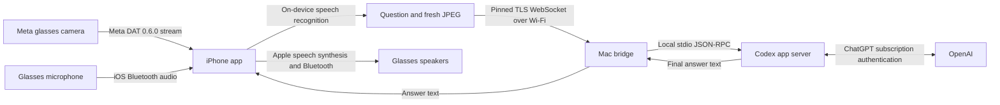

# Architecture and protocol

## Phone connection

Connect to `wss://<private-ip>:8845/v1/connect` using `Authorization: Bearer <paired-token>`. Verify the SHA-256 digest of the leaf certificate against the paired fingerprint. No token belongs in a WebSocket URL. Browser Origin headers are rejected. Frame payloads are capped and compression is disabled.

Phone messages:

| Type | Fields | Behavior |
| --- | --- | --- |
| `frame` | `jpeg`: base64 JPEG, at most 500 KB decoded | Replaces in-memory latest frame; no inference |
| `camera.off` | — | Drops latest frame |
| `ask` | `text`: 1–4000 characters | Uses latest frame if at most 3.5 seconds old at request processing |
| `cancel` | — | Interrupts current turn; does not delete conversation |
| `reset` | — | Interrupts current turn and starts fresh on next question |

Bridge events: `ready`, `thinking` (`hasImage`), `answer` (`text`), `error` (`message`), `cancelled`.

The iPhone checks that the source frame is at most 2.5 seconds old **before** transmitting. The bridge measures its own receipt age rather than trusting an iPhone clock. The model is told explicitly when no current image is attached. One inference runs at a time, with a 90-second deadline. Closing the socket cancels the turn. Every connection has a separate ephemeral Codex thread; there is no transcript sharing across phones.

## Intentional limits

Only the completed final assistant message is spoken. Intermediate commentary and reasoning are ignored. That is simpler than incremental sentence speech, but incurs extra response delay. Microphone recognition is paused until synthesis finishes. Voice interruption and a glasses hardware wake gesture are not implemented. The user can stop via the iPhone's accessible Stop control.

The Mac must remain powered, awake, connected to the internet, and reachable on the same Wi-Fi network. Router client isolation or blocked incoming local connections prevent pairing. The phone protocol does not expose file access endpoints or arbitrary app-server RPC. In local Codex mode, a spoken request can cause Codex to use the files, tools, plugins, and computer-use services already configured on the Mac. The loopback-only setup page controls the working folder and the installed apps available to Computer Use; RayBridge writes that allowed-app list into each new Codex task.

Subscription sign-in is implemented through `account/login/start` with `type: chatgpt`. As an alternative, the user can select the Mac's existing Codex login; RayBridge then inherits the normal `CODEX_HOME`, environment, Codex configuration, memories, plugins, and MCP servers. It launches a separate stdio app-server rather than attaching to an arbitrary interactive process. Local threads start in the folder selected on the setup page, use `workspace-write` with network access, and route eligible approvals to automatic review so voice requests can finish without a second interface. The separate-login mode retains the original read-only, tool-free restrictions. `account/read` must identify a ChatGPT account before inference; API-key and other provider accounts are rejected. The bridge uses `thread/start`, `turn/start`, `turn/interrupt`, and final item/turn notifications. Model selection follows the ChatGPT account's default rather than hardcoding an API-only model.

Sources: [OpenAI authentication](https://learn.chatgpt.com/docs/auth), [Codex app-server protocol](https://learn.chatgpt.com/docs/app-server), [Meta DAT repository](https://github.com/facebook/meta-wearables-dat-ios). API signatures were also checked against the installed Codex 0.146.0 generated schema and Meta DAT 0.6.0 compiled Swift interfaces.
