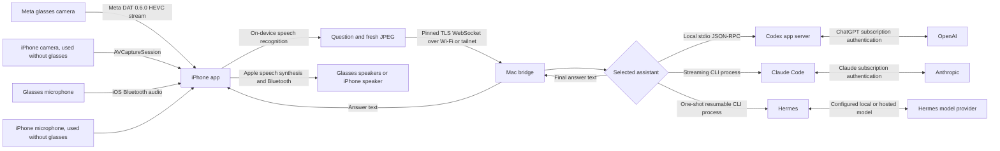

# Architecture and protocol

## Phone connection

Connect to `wss://<private-ip>:8845/v1/connect` using `Authorization: Bearer <paired-token>`. Verify the SHA-256 digest of the leaf certificate against the paired fingerprint. No token belongs in a WebSocket URL. Browser Origin headers are rejected. Frame payloads are capped and compression is disabled.

The paired host must be an IPv4 dotted quad in a private LAN range (10/8, 172.16/12, 192.168/16), the link-local range (169.254/16), or the shared range Tailscale uses for tailnet addresses (100.64/10), or a Tailscale MagicDNS name under `.ts.net`. Public addresses and all other hostnames are rejected, so the bridge cannot be paired to a public tunnel endpoint. The Mac reads its own MagicDNS name from `tailscale status --json` (`Self.DNSName`), caches it for 30 seconds against the setup page's polling, and `/api/pair` accepts only an address on one of its interfaces or that one name. Because the pinned certificate rather than the name authenticates the Mac, the self-signed certificate needs no `.ts.net` subject name; the iPhone carries an App Transport Security exception for `.ts.net` so the pinning delegate is reached, which relaxes neither TLS nor the pin. A tailnet is an encrypted point-to-point tunnel that carries the Mac's own certificate unchanged, so remote access keeps the same pinned, token-authenticated connection as the LAN path. A tunnel that terminates TLS at a third-party edge, such as ngrok or Tailscale Funnel, would break pinning and disclose the token, questions, images, and answers to the tunnel operator.

The iPhone keeps the five most recently paired Mac endpoints and their tokens and certificate fingerprints in its device-only Keychain record. One endpoint is active at a time and can be changed in Setup while no session is running. Pairing the same host and port again replaces its credentials and moves it to the top; existing one-Mac Keychain records migrate automatically.

Phone messages:

| Type | Fields | Behavior |
| --- | --- | --- |
| `frame` | `jpeg`: base64 JPEG, at most 500 KB decoded | Replaces in-memory latest frame; no inference |
| `camera.off` | — | Drops latest frame |
| `ask` | `text`: 1–4000 characters | Uses latest frame if at most 3.5 seconds old at request processing |
| `cancel` | — | Interrupts current turn; does not delete conversation |
| `status` | — | Returns a spoken summary of the current task state |
| `repeat` | — | Returns the latest completed answer for replay |
| `reset` | — | Interrupts current turn and starts fresh on next question |

Bridge events: `ready`, `thinking` (`hasImage`), `answer.partial` (`text`), `answer.discard`, `answer` (`text`), `coordinator.speech` (`text`), `error` (`code`, `message`, `fix`), `cancelled`.

Every `error` event carries what happened (`message`) and what to do about it (`fix`); the phone speaks both together. `code` is a stable identifier from the catalog in `bridge/errors.mjs` (for example `assistant.signed-out`, `turn.failed`, `turn.busy`). The fix for a missing sign-in depends on the selected assistant, because each one is authorized differently on the Mac.

Status and repeat pass through a short-lived action broker scoped to the authenticated phone session and connection epoch. Replayed action identifiers are idempotent, changed or expired envelopes are rejected, and the phone cannot select an arbitrary assistant method.

Claude Code and Hermes report the answer as it is written; Codex is unchanged and reports only the completed answer. `answer.partial` carries the next finished sentence of an answer the assistant is still writing, so the phone can start speaking before the turn completes. Each partial continues the one before it, and the completed `answer` always contains the whole text. The phone speaks only the part of that text it has not already spoken, and speaks the whole answer if the text no longer begins with what was spoken. `answer.discard` means the assistant replaced what it was writing: the phone stops mid-answer and waits. Partials are not sent when the Mac generates the answer audio with Kokoro, because that needs the finished text.

The iPhone checks that the source frame is at most 2.5 seconds old **before** transmitting. The bridge measures its own receipt age rather than trusting an iPhone clock. The model is told explicitly when no current image is attached. One inference runs at a time, with a 90-second deadline. Closing the socket cancels the turn.

The connection handshake already reads the assistant account, so a proven sign-in is reused for five minutes instead of being read again before every question. Reading it per question cost a CLI subprocess for Claude Code and Hermes. A failed turn drops the cached result, so a sign-out during a session is still reported.

Each turn logs its stage timings on the Mac, and the iPhone logs its own stages to the unified log. Both record fixed labels and durations only: no question, answer, image, or account detail. Every connection has a separate conversation in the selected assistant; there is no transcript sharing across phones or providers.

## Camera and audio source

The glasses are the default source and are not required. Before startup, a synchronous check of the Meta SDK classifies the glasses as ready, discovery-unavailable, unregistered, not found, not connected, still connecting, or needing an update. Anything but ready warns and offers the iPhone camera and speaker, the glasses anyway, or cancellation; that device state can lag the hardware, which is why an unready answer never blocks the glasses. A failure of the glasses camera or glasses audio during startup makes the same offer, while a Mac connection or iPhone permission failure does not, because dropping the glasses would not fix it. A saved preference of `This iPhone` skips the check, the warning, and Meta registration.

Both sources report through one interface, so the session lifecycle, frame limits, staleness rule, and protocol are identical: one JPEG per second, at most 500 KB, and a usable image is required before the microphone starts. The iPhone source captures 1280x720 on a private queue, rotates frames upright, re-encodes down to the size limit, and leaves the app's audio session alone. Without glasses the iPhone carries the microphone, cues, confirmations, and answers, so losing a Bluetooth route no longer ends the session. The Mac is still required; only the glasses are optional.

The glasses source requests Meta DAT's compressed `hvc1` stream because its raw stream pauses when iOS backgrounds the app. Every HEVC frame is decoded through a software VideoToolbox session because iOS tears down hardware video decoders in the background; JPEG encoding remains limited to one frame per second. With the audio, Bluetooth, and external-accessory background modes enabled, an active glasses session keeps its camera, on-device recognition, voice commands, Mac connection, and answer audio while the phone is locked or another app is open. Backgrounding does not reset the current turn or partially spoken answer. Stopped-app voice standby ends in the background, so the user must start RayBridge before locking the phone.

The iPhone source enables `AVCaptureSession.isMultitaskingCameraAccessEnabled` whenever the system reports support. Ordinary iPhone configurations do not grant this to non-video-conferencing apps, so the fallback pauses camera capture and explicitly sends `camera.off` before any frame becomes stale. The microphone, on-device recognition, commands, connection, and answer playback remain active; nonvisual questions continue normally, and visual questions receive no image. Returning to the foreground restarts the camera on the same RayBridge session after its background stop has finished.

## Intentional limits

Finished sentences of the answer are spoken as they are written; reasoning and intermediate commentary are not. Claude Code text is forwarded from its streaming events, and text written before the assistant calls a tool is withdrawn, because that was preparation rather than the answer. Withdrawing text twice in one turn stops streaming for that turn. Microphone recognition is paused until synthesis finishes. Voice interruption and a glasses hardware wake gesture are not implemented. The user can stop via the iPhone's accessible Stop control.

The Mac must remain powered, awake, connected to the internet, and reachable on the same Wi-Fi network or tailnet. Router client isolation or blocked incoming local connections prevent pairing. Over a tailnet the Mac is unattended, so sleep or a closed lid ends the session with nobody present to restart it. The phone protocol does not expose file access endpoints or arbitrary app-server RPC. In local Codex mode, a spoken request can cause Codex to use the files, tools, plugins, and computer-use services already configured on the Mac. The loopback-only setup page controls the working folder and the installed apps available to Computer Use; RayBridge writes that allowed-app list into each new Codex task.

Subscription sign-in is implemented through `account/login/start` with `type: chatgpt`. As an alternative, the user can select the Mac's existing Codex login; RayBridge then inherits the normal `CODEX_HOME`, environment, Codex configuration, memories, plugins, and MCP servers. It launches a separate stdio app-server rather than attaching to an arbitrary interactive process. Local threads start in the folder selected on the setup page, use `workspace-write` with network access, and route eligible approvals to automatic review so voice requests can finish without a second interface. The separate-login mode retains the original read-only, tool-free restrictions. `account/read` must identify a ChatGPT account before inference; API-key and other provider accounts are rejected. The bridge uses `thread/start`, `turn/start`, `turn/interrupt`, and final item/turn notifications. Model selection follows the ChatGPT account's default rather than hardcoding an API-only model.

Claude Code uses the CLI login and configuration already present on the Mac. RayBridge invokes print mode with streaming JSON in and out, adds partial message output when the installed CLI offers it, and gives each phone connection its own resumable Claude session.

One Claude process stays open for that whole conversation and each question is written to it as a message. Starting a process per question cost its startup and a replay of the conversation so far before the model could begin; on this machine an otherwise identical question took about 3.1 seconds that way and about 1.6 seconds on an already open process. The first question of a conversation still pays the startup, because that is when the process opens.

A current camera frame travels inside the question as an image, so answering a visual question no longer needs a separate file-reading step first, and no frame is written to disk. The image stays in that conversation's history, which is why the assistant is told to describe only the image attached to the question it is answering.

File edits are accepted; actions that require an interactive permission prompt are denied because the glasses session has no secure approval interface. Cancellation interrupts the turn and leaves the process open, so the next question keeps both the conversation and the open process. A process that does not stop within three seconds is ended, and the next question resumes the conversation in a new one.

Hermes uses the model, memories, project instructions, tools, plugins, MCP servers, and computer-use configuration already present on the Mac. Each phone connection gets a private named Hermes session and each question runs through quiet one-shot mode with the prompt on standard input. Current images are staged in a private directory and attached with Hermes's image option, then deleted; Hermes starts a process per question. Hermes's `approvals.single_query_mode` controls unattended dangerous actions and defaults to deny. Cancellation terminates the active Hermes process. All three backends are normalized behind the same assistant contract before they reach the phone session.

The iPhone stores its selected assistant and sends that choice in the authenticated, certificate-pinned WebSocket handshake. The Mac switches and validates the selected CLI before sending the ready event, then remembers that provider for the Mac setup screen. A failed launch restores the previous backend. An unsigned-in provider returns an error before the camera and microphone start, using the same spoken startup-error path as other connection failures.

Sources: [OpenAI authentication](https://learn.chatgpt.com/docs/auth), [Codex app-server protocol](https://learn.chatgpt.com/docs/app-server), [Meta DAT repository](https://github.com/facebook/meta-wearables-dat-ios). API signatures were also checked against the installed Codex 0.146.0 generated schema and Meta DAT 0.6.0 compiled Swift interfaces.
